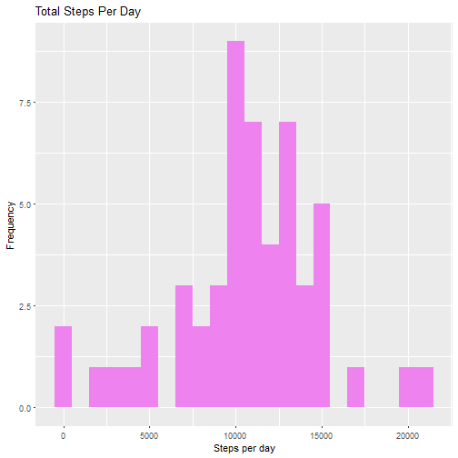
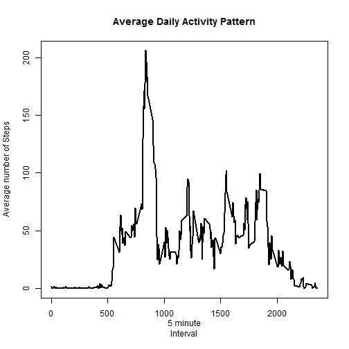
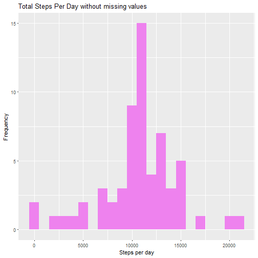
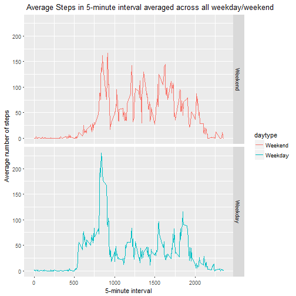

## Introduction

This assignment makes use of data from a personal activity monitoring device. This device collects data at 5 minute intervals through out the day. The data consists of two months of data from an anonymous individual collected during the months of October and November, 2012 and include the number of steps taken in 5 minute intervals each day.

The dataset is stored in a comma-separated-value (CSV) file and there are a total of 17,568 observations in this dataset.

##Loading and preprocessing the data

It is assumed that the file is downloaded and currently in the working directory. If not, you can download the file [here](https://d396qusza40orc.cloudfront.net/repdata%2Fdata%2Factivity.zip)


```r
library(knitr)
options(scipen = 1, digits = 2)
library (ggplot2)
repdata<-read.csv("activity.csv", header=TRUE, sep=",",quote= "\"",,na.strings = "NA",nrows = -1,skip = 0)
```

### Process/Transform the data 


```r
repdata$date=as.Date(repdata$date)
repdata$steps=as.numeric(repdata$steps)
```

This assignment report need to have answers for the following questions detailed below

##What is mean total number of steps taken per day?

  For this part of the assignment, you can ignore the missing values in the dataset.
  
  1) Calculate the total number of steps taken per day
  2) Make a histogram of the total number of steps taken each day
  3) Calculate and report the mean and median of the total number of steps taken per day

Lets the calculate total number of steps taken per day


```r
TotalStepsByDay<-aggregate(steps~date, repdata , sum, na.rm=TRUE)
```

Next, a histogram of the daily total number of steps taken is generated, showing the distribution of these totals.


```r
ggplot(data=TotalStepsByDay, aes(TotalStepsByDay$steps)) +   geom_histogram(fill = "Violet", binwidth = 1000) +
labs(title = "		Total Steps Per Day", x = "Steps per day", y = "Frequency")
```



Next, we need to calculate and report the mean and median of the total number of steps taken per day


```r
mean(TotalStepsByDay$steps)
```

```
## [1] 10766
```


```r
median(TotalStepsByDay$steps)
```

```
## [1] 10765
```

The mean is 10766.19 steps and the median is 10765 steps.

##What is the average daily activity pattern?

1) Make a time series plot (i.e. type = "l") of the 5-minute interval (x-axis) and the average number of steps taken, averaged 
across all days (y-axis)
2) Which 5-minute interval, on average across all the days in the dataset, contains the maximum number of steps?

To make a time series plot of the 5- minute interval and the average number of steps taken, lets calculate the mean first


```r
averageDaily <- aggregate(steps~interval,repdata, mean, na.rm=TRUE)
```

Lets Plot the Average Daily Activity Pattern calculated 


```r
plot(averageDaily$interval, averageDaily$steps,type="l",lwd=2,main="Average Daily Activity Pattern",xlab=" 5 minute 
Interval",ylab="Average number of Steps")
```



Next, we need to find Which 5-minute interval on average across all the days in the dataset, contains the maximum number of steps

```r
averageDaily[which.max(averageDaily$steps),]
```

```
##     interval steps
## 104      835   206
```

The Maximum number of steps is 206.17 and the corresponding interval is 
835

##Imputing missing values
Note that there are a number of days/intervals where there are missing values (coded as NA). The presence of missing days may introduce bias into some calculations or summaries of the data. So we need to   

1) Calculate and report the total number of missing values in the dataset (i.e. the total number of rows with NAs)
2) Devise a strategy for filling in all of the missing values in the dataset. The strategy does not need to be sophisticated. For example, you could use the mean/median for that day, or the mean for that 5-minute interval, etc.
3) Create a new dataset that is equal to the original dataset but with the missing data filled in.
4) Make a histogram of the total number of steps taken each day and Calculate and report the mean and median total number of steps taken per day. Do these values differ from the estimates from the first part of the assignment? What is the impact of imputing missing data on the estimates of the total daily number of steps?

To impute the missing values, lets find how many missing rows are present

```r
sum(is.na(repdata$steps))
```

```
## [1] 2304
```

The Total number of missing is 2304

The Strategy to replace the missing value is to calculate the mean of the steps for the interval and replace the missing values with those mean for the corresponding interval,

Lets first copy the dataset into another dataset

```r
repdatanew<-repdata
```

Copy the missing rows into another dataset

```r
missing_rows<-is.na(repdatanew$steps)
```
Calculate the mean of the steps by interval using tapply 

```r
mean_steps<-tapply(repdatanew$steps, repdatanew$interval, mean,na.rm=TRUE, simplify=TRUE)
```

Lets replace the missing values with the mean calculated

```r
repdatanew$steps[missing_rows]<-mean_steps[as.character(repdatanew$interval[missing_rows])]
```

With the missing values filled with the mean value, lets calculate the average number of steps taken each day

```r
TotalStepsByDaynew<-aggregate(steps~date, repdatanew , sum, na.rm=TRUE)
```
Next , lets Plot the average steps with the new Data in Histogram


```r
ggplot(data=TotalStepsByDaynew, aes(TotalStepsByDaynew$steps)) +   geom_histogram(fill = "Violet", binwidth = 1000) +
labs(title = "Total Steps Per Day without missing values", x = "Steps per day", y = "Frequency")
```



Lets now calculate the mean number of steps taken each day using the new data set 

```r
mean(TotalStepsByDaynew$steps)
```

```
## [1] 10766
```

Also , calculate the median of steps taken each day using the new data set

```r
median(TotalStepsByDaynew$steps)
```

```
## [1] 10766
```

Now the mean with the new data set which contains no missing values is 
10766.19 and the median is 10766.19.  Earlier, With the missing values we calculated the mean as  10766.19 steps and the median as 10765 steps. There is not much of a difference , however we see the mean and median are equal with the missing values filled in. The histogram also shows the data shows that most values are distributed in the center.


##Are there differences in activity patterns between weekdays and weekends?

We need to Use the dataset with the filled-in missing values for this part.  

1) Create a new factor variable in the dataset with two levels - "weekday" and "weekend" indicating whether a given date is a weekday or weekend day.  
2) Make a panel plot containing a time series plot (i.e. type = "l") of the 5-minute interval (x-axis) and the average number of steps taken, averaged across all weekday days or weekend days (y-axis). 

Lets create a variable called daytype in the new data set and categorise the day as weekday or weekend


```r
repdatanew$date<-as.Date(repdatanew$date)
weekday<-c("Monday","Tuesday","Wednesday","Thursday","Friday")
repdatanew$daytype<-factor((weekdays(repdatanew$date) %in% weekday), levels=c(FALSE, TRUE), labels=c('Weekend', 'Weekday'))
```

We need to calculate the average steps in the 5-minute interval a

```r
averagestepsweek<- aggregate(steps ~ interval+daytype, data=repdatanew, mean, na.rm=TRUE)
```

Now, we need to make a panel plot containing a time series plot (i.e. type = "l") of the 5-minute interval (x-axis) and the average number of steps taken, averaged across all weekday days or weekend days (y-axis). 

```r
ggplot(averagestepsweek, aes(interval, steps, color=daytype)) + geom_line() + facet_grid(daytype ~ .) +
    labs(title=" Average Steps in 5-minute interval averaged across all weekday/weekend",
x="5-minute interval",y="Average number of steps" )
```



We can infer from the panel plot that weekends have more activities that weekdays. Also the weekend activities are throughout the day when compared to weekdays.The weekdays have peak activities in the early hours of the morning when compared to weekends
